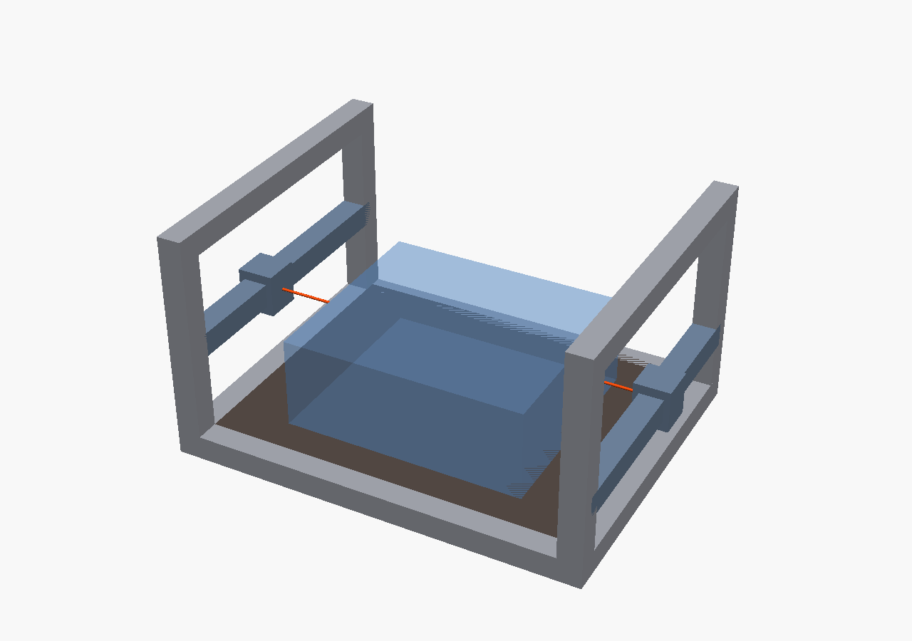
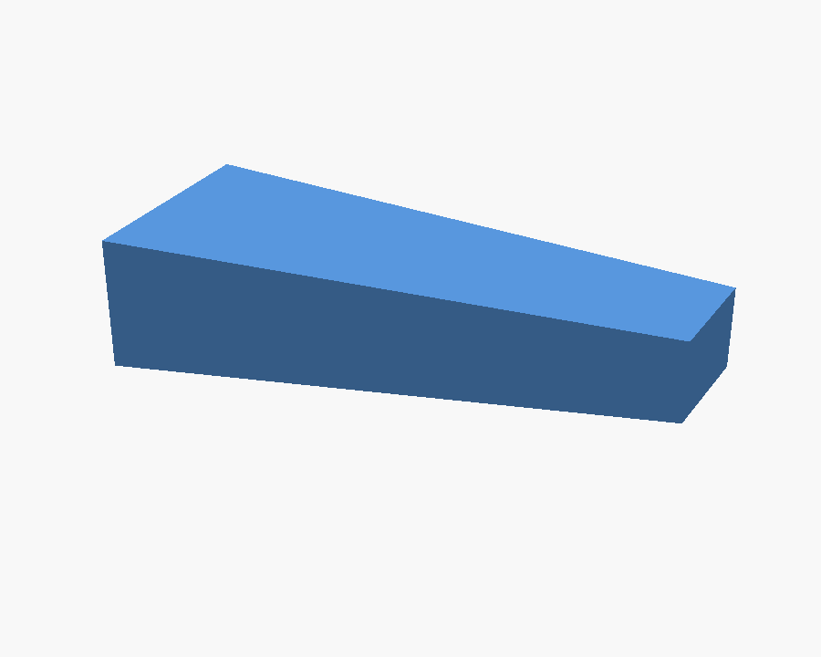
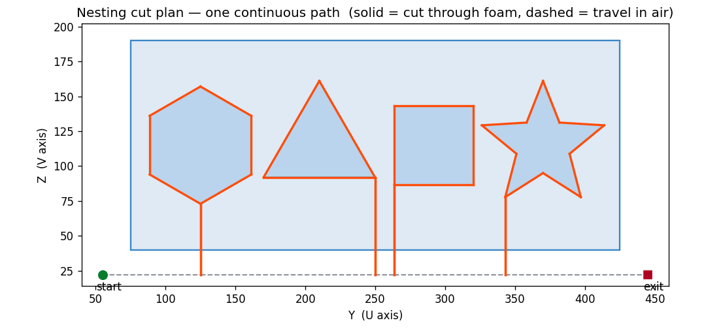
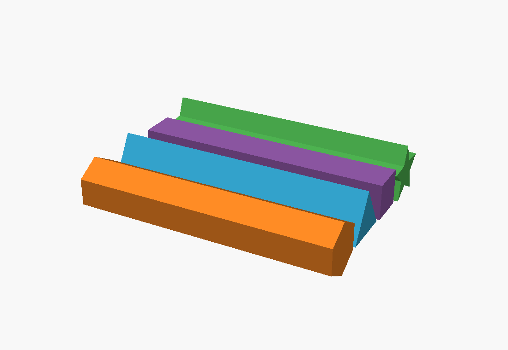
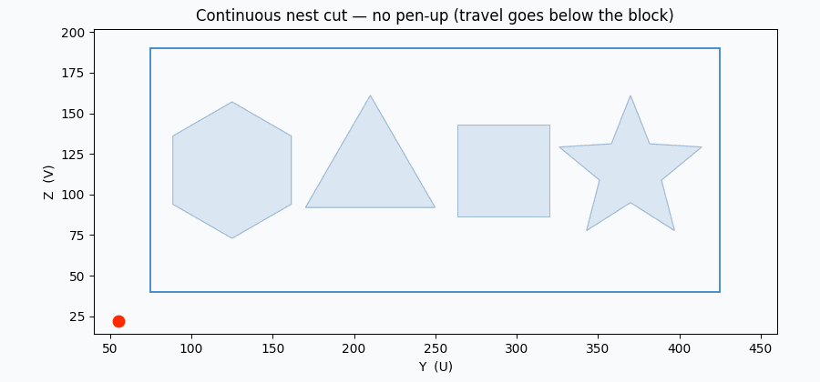
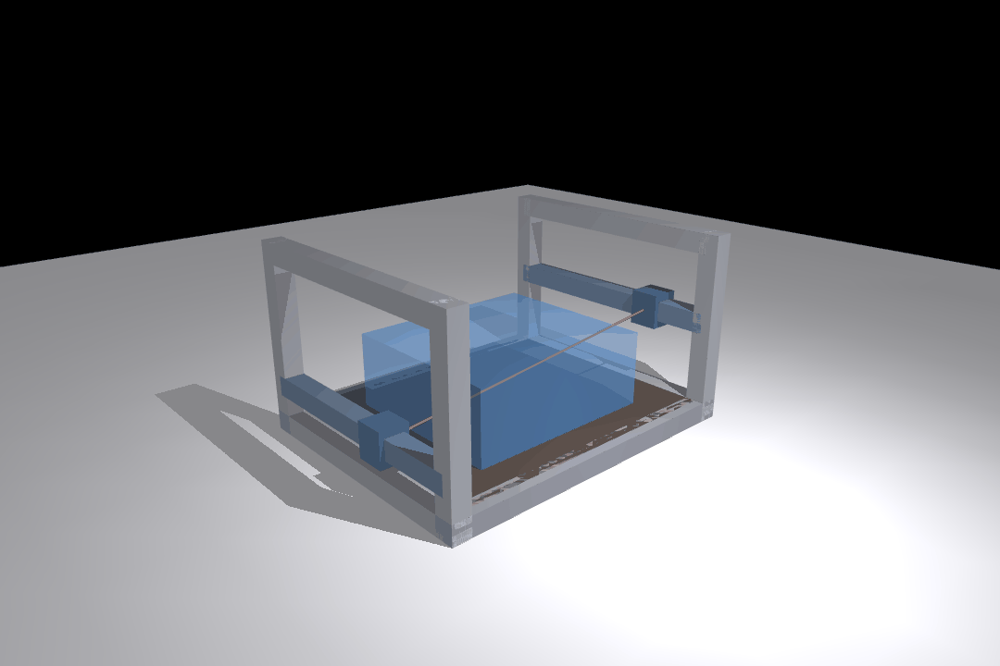
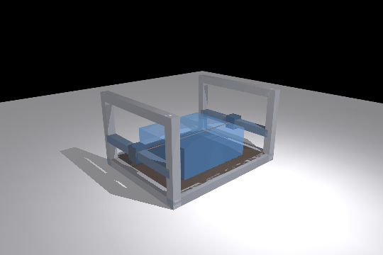

# CNC Hot-Wire Foam Cutter

A 4-axis hot-wire foam cutter for clean, fast prototype solids — vacuum-form bucks,
general fabrication, and art — without the dust of a CNC router.

**Architecture (v1): two-tower, 4-axis.** Two facing vertical gantry frames, each an
XY stage moving one end of a heated wire. Four independent axes drive the two wire ends;
because the wire is straight, the machine cuts **ruled surfaces** — extrusions, tapers,
and lofts between two different face profiles. Compound curves (domes/blobs) are out of
reach for a single straight wire — see the open question below.

```
X  wire axis      spans left tower (x=0) to right tower (x=CUT_WIDTH)
Y  foam length    horizontal carriage travel   (per-side "U" axis)
Z  vertical       carriage height              (per-side "V" axis)

left  wire end at (0,        U_L, V_L)
right wire end at (CUT_WIDTH, U_R, V_R)
  (U_L,V_L) == (U_R,V_R)  ->  wire square across  ->  straight extrusion
  (U_L,V_L) != (U_R,V_R)  ->  wire tilts          ->  ruled loft (the 4-axis payoff)
```

Current envelope (all in `cad/machine_params.py`, the single source of truth):
600 (X) × 500 (Y) × 300 (Z) mm cut volume; 40×40 extrusion frame.

## Gallery

| Two-tower 4-axis machine | Ruled loft (the 4-axis payoff) |
|---|---|
|  |  |
| Wire tilts through the block — left/right carriages at different heights | Different left/right face profiles → a tapered ruled solid |



*Nesting cut plan — one continuous path: solid = cut through foam, dashed = travel in air,
with a lead-in slit down to each part (a hot wire has no pen-up).*

| Tray of prismatic parts | Continuous nest cut |
|---|---|
|  |  |

| Interactive MuJoCo bench (`make mujoco`) | 4-axis sweep (headless demo) |
|---|---|
|  |  |

## Layout

```
cad/
  machine_params.py   SINGLE SOURCE OF TRUTH — every shared dimension + place() helper
  frame.py            static structure: base + two vertical gantry frames
  stage.py            one side's moving assembly (gantry beam + Y carriage + wire mount)
  wire.py             the wire — a derived cylinder between the two carriage mounts
  foam.py             bed + foam work block
  machine.py          assemble at a 4-axis pose -> per-part STLs + iso render
  snap.sh             log a render into renders/<machine>/ (dated history)
  build/              STLs + current cnc_hotwire_iso.png
  renders/cnc_hotwire/  dated PNG history + INDEX.md
sim/
  cut_sim.py          kinematic cut: ruled solids (extrusion vs taper) + swept-wire GIF
  out/                extrusion.png, taper.png, cut_sweep.gif
```

## Run

Everything is driven by the Makefile (`make help` lists all targets):

```bash
make                 # run the cut + nest simulations
make mujoco          # INTERACTIVE MuJoCo viewer — drive the 4 axes, the wire follows
make mujoco-demo     # headless sweep -> sim/out/mujoco_sweep.gif
make machine         # assemble + render -> cad/build/cnc_hotwire_iso.png
make all             # machine render + both sims
make snap NOTE=...   # log the current render into the dated history
```

## Governing constraint: a hot wire has no "pen-up"

The wire is a straight segment anchored on both towers, spanning the full block width;
it cuts wherever it passes through foam. Therefore:

- **Travel = route the path around/below the block** (wire in air -> no cut).
- **Each interior part needs a lead-in slit from an edge** (cut in, trace, back out the
  same slit). That slit is the parting line.
- **A whole nest is ONE continuous path** — through-foam segments cut, in-air segments
  travel. Nesting is a continuous-path routing problem, not laser-style pen-up nesting.
- (Slit-free closed cuts would need de-tension + re-thread the wire mid-job, EDM-style —
  a large mechanism jump, deferred unless pristine closed parts are required.)

The 4-axis taper is NOT just a bonus: a **draft angle on a vacuum-form buck is a ruled
taper**, so the second pair of axes directly serves the forming goal.

## Primary workflow (decided)

**Ruled surfaces only.** Nest many prismatic parts in one block cross-section and part
them off — far more efficient than cutting thin sheets. See `sim/nest_sim.py`
(`nest_plan.png`, `nest_parts.png`, `nest_cut.gif`).

## Status & next steps

- [x] Parametric two-tower 4-axis CAD model (stand-in primitives at concept stage)
- [x] Kinematic cut simulation — ruled solids + swept-wire animation
- [x] Nesting simulation — continuous-path cut plan + tray of prismatic parts
- [x] Interactive MuJoCo sim — 4 driven axes + wire tendon (`make mujoco`)
- [ ] **Wire subsystem (now the #1 driver)** — tension (spring/constant-force) + temp
      control (PWM/constant-current). Sets **kerf** consistency, which sets nesting tightness.
- [ ] Repeatable profiling accuracy — backlash, squareness, wire alignment/sag
- [ ] CAM — continuous-path nest routing + automatic lead-in/slit generation
- [ ] MuJoCo dynamics — belt/mass/accel, wire thermal sag (needs motor/mass specs)
- [ ] Real parts — carriages, wire mounts, motor/idler mounts (per build123d-part rules)
