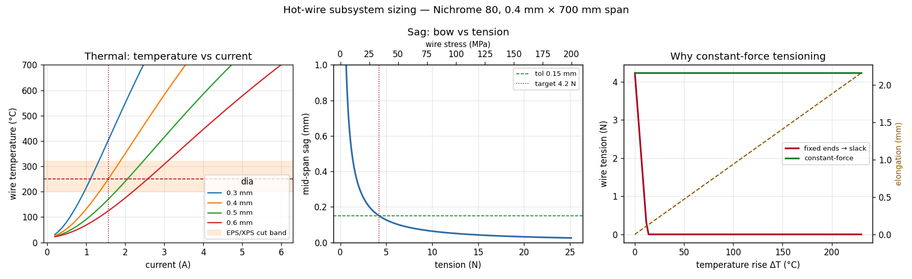
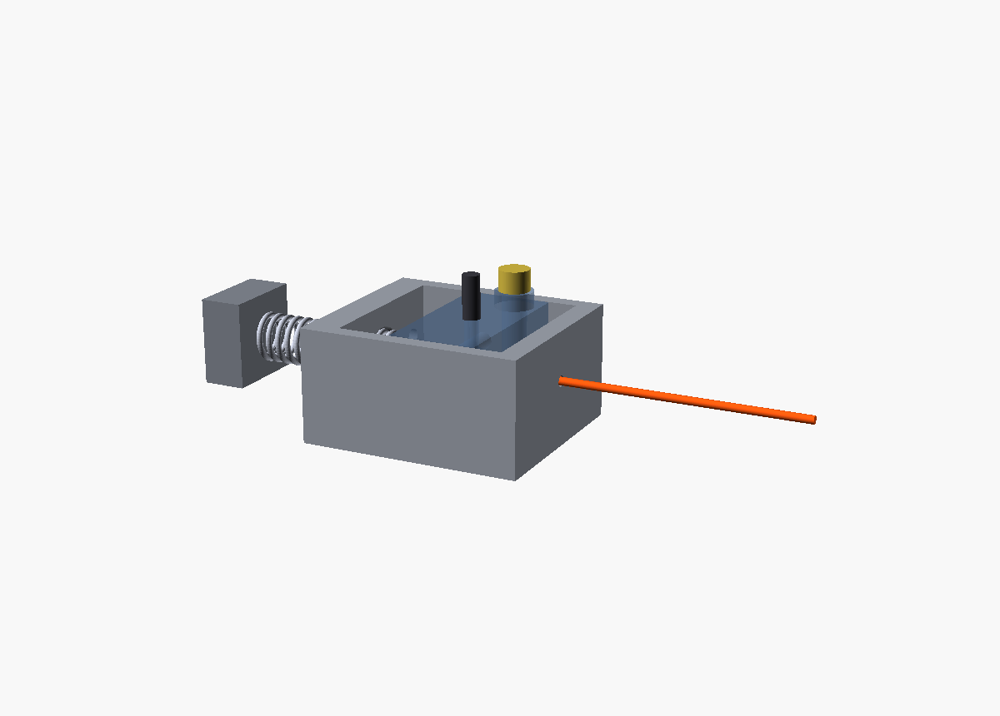
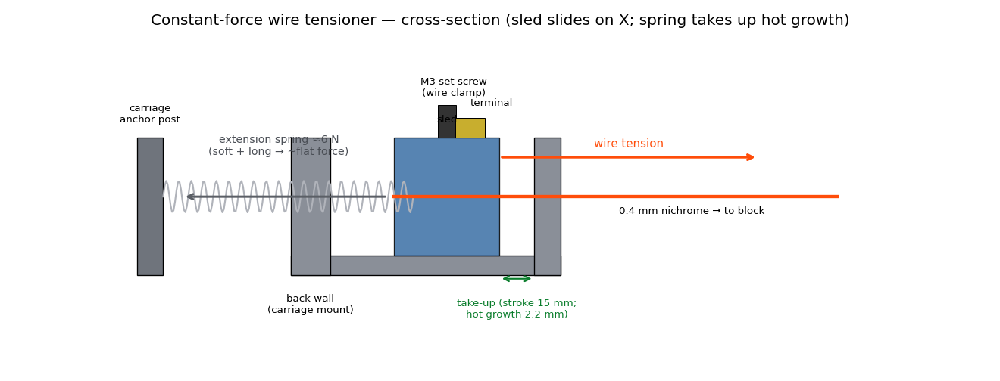
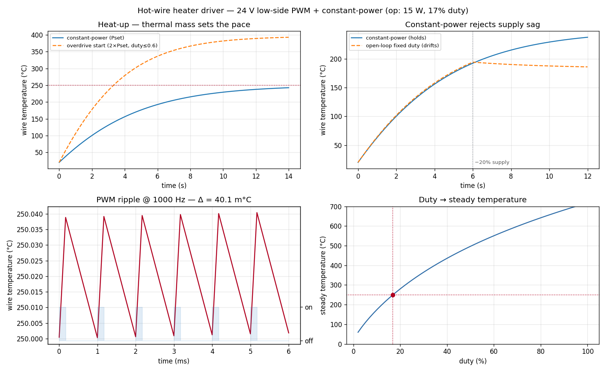

# CNC Hot-Wire Foam Cutter

A 4-axis hot-wire foam cutter for clean, fast prototype solids — vacuum-form bucks,
general fabrication, and art — without the dust of a CNC router.

**Architecture (v1): two-tower, 4-axis.** Two facing vertical gantry frames, each an
XY stage moving one end of a heated wire. Four independent axes drive the two wire ends;
because the wire is straight, the machine cuts **ruled surfaces** — extrusions, tapers,
and lofts between two different face profiles. Compound curves (domes/blobs) are out of
reach for a single straight wire — see the open question below.

```
X  wire axis      spans left tower (x=0) to right tower (x=CUT_WIDTH)
Y  foam length    horizontal carriage travel   (per-side "U" axis)
Z  vertical       carriage height              (per-side "V" axis)

left  wire end at (0,        U_L, V_L)
right wire end at (CUT_WIDTH, U_R, V_R)
  (U_L,V_L) == (U_R,V_R)  ->  wire square across  ->  straight extrusion
  (U_L,V_L) != (U_R,V_R)  ->  wire tilts          ->  ruled loft (the 4-axis payoff)
```

Current envelope (all in `cad/machine_params.py`, the single source of truth):
600 (X) × 500 (Y) × 300 (Z) mm cut volume; 40×40 extrusion frame.

## Gallery

| Two-tower 4-axis machine | Ruled loft (the 4-axis payoff) |
|---|---|
|  |  |
| Wire tilts through the block — left/right carriages at different heights | Different left/right face profiles → a tapered ruled solid |


*Nesting cut plan — one continuous path: solid = cut through foam, dashed = travel in air,
with a lead-in slit down to each part (a hot wire has no pen-up).*

| Tray of prismatic parts | Continuous nest cut |
|---|---|
|  |  |

| Interactive MuJoCo bench (`make mujoco`) | 4-axis sweep (headless demo) |
|---|---|
|  |  |



*Wire subsystem sizing (`make wire`) — temperature vs current (gauge sweep), mid-span sag
vs tension, and why tensioning must be constant-force.*

| Wire tensioner mechanism (`make tensioner`) | How it works (cross-section) |
|---|---|
|  |  |



*Heater driver sizing (`make driver`) — heat-up, constant-power supply-sag rejection, the
40 m°C PWM ripple (→ stable kerf), and the duty→temperature map.*

## Layout

```
cad/
  machine_params.py     SINGLE SOURCE OF TRUTH — every shared dimension + place() helper
  frame.py              static structure: base + two vertical gantry frames
  stage.py              one side's moving assembly (gantry beam + Y carriage + wire mount)
  wire.py               the wire — a derived cylinder between the two carriage mounts
  foam.py               bed + foam work block
  machine.py            assemble at a 4-axis pose -> per-part STLs + iso render
  partlib.py            small shared through-hole helpers
  tensioner_bracket.py  printed channel that bolts to the carriage (build123d-part)
  tensioner_sled.py     printed sliding wire carrier (clamp + terminal + spring hook)
  tensioner.py          tensioner subassembly -> iso + section + labeled diagram
  snap.sh               log a render into renders/<machine>/ (dated history)
  build/                STLs + renders (git-ignored)
  renders/cnc_hotwire/  dated PNG history + INDEX.md
sim/
  cut_sim.py            kinematic cut: ruled solids (extrusion vs taper) + swept-wire GIF
  nest_sim.py           nesting: continuous-path cut plan + tray of parts + animation
  wire_analysis.py      thermo-mechanical wire sizing (thermal / sag / expansion)
  heater_driver.py      heater-driver electro-thermal sim + component selection
  mujoco_sim.py         interactive MuJoCo bench (make mujoco) + headless demo / selftest
  out/                  generated pngs / gifs (git-ignored)
```

## Run

Everything is driven by the Makefile (`make help` lists all targets):

```bash
make                 # run the cut + nest simulations
make wire            # thermo-mechanical wire sizing -> sim/out/wire_analysis.png
make driver          # heater-driver electro-thermal sim -> sim/out/heater_driver.png
make tensioner       # verify printed parts (watertight) + render tensioner assembly
make mujoco          # INTERACTIVE MuJoCo viewer — drive the 4 axes, the wire follows
make mujoco-demo     # headless sweep -> sim/out/mujoco_sweep.gif
make machine         # assemble + render -> cad/build/cnc_hotwire_iso.png
make all             # machine render + both sims
make snap NOTE=...   # log the current render into the dated history
```

## Governing constraint: a hot wire has no "pen-up"

The wire is a straight segment anchored on both towers, spanning the full block width;
it cuts wherever it passes through foam. Therefore:

- **Travel = route the path around/below the block** (wire in air -> no cut).
- **Each interior part needs a lead-in slit from an edge** (cut in, trace, back out the
  same slit). That slit is the parting line.
- **A whole nest is ONE continuous path** — through-foam segments cut, in-air segments
  travel. Nesting is a continuous-path routing problem, not laser-style pen-up nesting.
- (Slit-free closed cuts would need de-tension + re-thread the wire mid-job, EDM-style —
  a large mechanism jump, deferred unless pristine closed parts are required.)

The 4-axis taper is NOT just a bonus: a **draft angle on a vacuum-form buck is a ruled
taper**, so the second pair of axes directly serves the forming goal.

## Primary workflow (decided)

**Ruled surfaces only.** Nest many prismatic parts in one block cross-section and part
them off — far more efficient than cutting thin sheets. See `sim/nest_sim.py`
(`nest_plan.png`, `nest_parts.png`, `nest_cut.gif`).

## Wire subsystem (sized — `make wire`)

Nichrome 80, **0.4 mm**, 700 mm heated span (`sim/wire_analysis.py`; chosen values in
`machine_params.py`):

- **Thermal:** ~**1.6 A / 10 V / 16 W** holds 250 °C (clean EPS/XPS); loss is convection-
  dominated. A 24 V supply with PWM / constant-current control has ample headroom.
- **Tension:** **5 N** (~0.5 kgf) keeps mid-span sag under 0.15 mm at only ~34 MPa wire
  stress (×6 margin) — sag, not strength, is the binding constraint.
- **Constant-force tensioning is mandatory:** the wire grows **2.2 mm** when hot; with
  fixed ends that erases the pre-tension and it goes slack (→ large sag). A constant-force
  tensioner with >3 mm take-up holds tension flat. This is the key design conclusion.
- **Kerf ~0.7 mm** → nest pitch = part + 0.7 mm.

## Wire tensioner (mechanism — `make tensioner`)

A printable **sled-in-channel** constant-force tensioner (`cad/tensioner_*.py`):

- **Bracket** — open-top channel bolts to the carriage; guides the sled, anchors the spring,
  passes the wire through the front wall. **Sled** — slides on the wire axis with an M3
  set-screw wire clamp, an electrical terminal boss, and a spring hook.
- A **soft stainless extension spring** (~8 mm OD, ~25 mm free, ~0.3 N/mm), anchored to a post
  on the carriage ~30 mm behind the bracket so it stays near-constant over the travel, pulls the
  sled with **~6 N**; the **15 mm stroke** absorbs the 2.2 mm hot growth. (A true constant-force
  spring is the tighter-tolerance upgrade.) This is the constant-force behaviour the analysis
  proved mandatory.
- Force is along the wire axis, so gravity + the channel capture the sled — no printed overhangs.
- Both printed parts pass the watertight / single-body slicer gate.

## Heater driver (sized — `make driver`)

Low-side logic-level **N-MOSFET PWM** from a 24 V supply with a **current-sense shunt for
closed-loop constant-power** (`sim/heater_driver.py`):

- The load is a pure resistor, so **no flyback diode** — the single biggest simplification vs a
  motor driver.
- **Constant-power** (≈ constant-current, since nichrome's R barely drifts) holds temperature —
  hence kerf — against supply sag and resistance drift; open-loop fixed duty wanders.
- **~15 W / 17 % duty** at the 250 °C operating point; **PWM ripple is 40 m°C** at 1 kHz because
  the wire's thermal mass (τ ≈ 4 s) filters it → stable kerf.
- MOSFET dissipates **~30 mW** (resistive load, low duty) → any logic-level FET runs cold.
- Parts: 24 V/≥4 A supply, logic-level N-MOSFET (IRLZ44N/IRLB8721), 0.05 Ω shunt + INA180, MCU
  PWM, ~5 A fuse + TVS + open-wire detect. Standalone alt: a CC buck module set to I_set.

## Status & next steps

- [x] Parametric two-tower 4-axis CAD model (stand-in primitives at concept stage)
- [x] Kinematic cut simulation — ruled solids + swept-wire animation
- [x] Nesting simulation — continuous-path cut plan + tray of prismatic parts
- [x] Interactive MuJoCo sim — 4 driven axes + wire tendon (`make mujoco`)
- [x] **Wire subsystem sizing** — thermo-mechanical analysis (`make wire`): gauge, PSU,
      tension, elongation, kerf. Key result: constant-force tensioning is mandatory.
- [x] **Wire tensioner mechanism** — printable sled-in-channel (`make tensioner`), watertight
- [x] **Real spring spec'd** — soft extension spring (~6 N) on a carriage anchor post
- [x] **Heater driver sized** — low-side PWM + constant-power (`make driver`), no flyback diode
- [ ] Mount the tensioner on the carriage — integrate into the machine assembly
- [ ] Driver hardware — schematic/PCB (or a CC buck module) wired to the controller
- [ ] MuJoCo **sag validation** — chain/cable under gravity + tension vs the catenary formula
- [ ] Repeatable profiling accuracy — backlash, squareness, wire alignment/lag
- [ ] CAM — continuous-path nest routing + automatic lead-in/slit generation
- [ ] Real parts — carriages, motor/idler mounts (per build123d-part rules)
